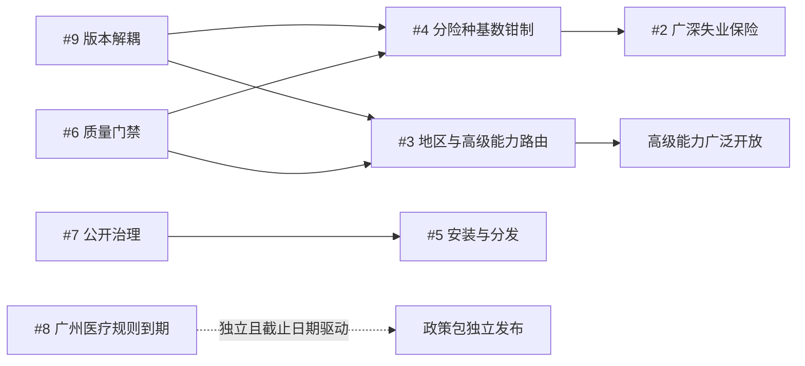

# Issue 修改路线图

## 目的与规划规则

本路线图把开放的 GitHub Issues #1 至 #8 与“发行版本/引擎语义版本解耦”工作编排为可执行顺序。GitHub Issue tracker 是工作状态、负责人和讨论结论的唯一来源；本文只记录计划，不以复选框替代 GitHub 状态。

- 所有行为变更采用 TDD：先写失败测试，再做最小实现，最后重构并运行完整门禁。
- 可执行政策值必须有可核验的 `gov.cn` 官方证据、有效期和双时态记录；证据不足时返回 `UNKNOWN`、`PARTIAL` 或 `BLOCKED`，不得猜值。
- 测试、示例、Issue 和 PR 只使用从零构造的合成数据，不得使用或提交真实个人身份信息、权益单、运行工件或其派生数据。
- 已发布政策包与运行不可原地改写；替代版本必须保持不可变、可寻址、可重放。
- `PACKAGE_VERSION` 表示 Python 包发行版本，随发行节奏独立提升；`ENGINE_SEMANTICS_VERSION` 只在计算、资格、能力状态、规范化或结构化输出语义变化时提升。
- `run_id` 包含引擎语义版本和规则集摘要，不包含包发行版本；仅更新证据或规则包时由 ruleset digest 改变运行身份，不应仅因此提升引擎语义版本。

## 状态总览

| 工作项 | 优先级 | 目标里程碑 | 依赖 | 状态 |
|---|---:|---|---|---|
| [#8 Policy expiry alert](https://github.com/Alaric1098/China-Pension-Strategy-Skill/issues/8) | P0 | 政策维护轨 | 无，截止日期驱动 | 待处理（Issue open） |
| [#9 解耦发行版本与引擎语义版本](https://github.com/Alaric1098/China-Pension-Strategy-Skill/issues/9) | P1 | v0.1.2 | 无 | 已完成（v0.1.2） |
| [#6 引入 Ruff 与类型检查质量门禁](https://github.com/Alaric1098/China-Pension-Strategy-Skill/issues/6) | P1 | v0.1.2 | 无，可与版本解耦并行 | 已完成（v0.1.2） |
| [#7 补齐安全政策、贡献模板与公开治理入口](https://github.com/Alaric1098/China-Pension-Strategy-Skill/issues/7) | P1 | v0.1.2 | 无，可与版本解耦并行 | 已完成（v0.1.2） |
| [#4 按险种和地区实施缴费基数钳制](https://github.com/Alaric1098/China-Pension-Strategy-Skill/issues/4) | P1 | v0.2 计算能力 | 版本解耦、#6 | 待处理（Issue open） |
| [#2 补齐广深灵活就业失业保险的 2026 官方费率与自愿参保模型](https://github.com/Alaric1098/China-Pension-Strategy-Skill/issues/2) | P2 | v0.2 计算能力 | #4 | 待处理（Issue open） |
| [#3 解耦北京适配器并完善高级养老能力的地区路由](https://github.com/Alaric1098/China-Pension-Strategy-Skill/issues/3) | P2 | v0.2 计算能力 | 版本解耦、#6 | 待处理（Issue open） |
| [#1 补齐十城参保、申报和补贴办理流程指南](https://github.com/Alaric1098/China-Pension-Strategy-Skill/issues/1) | P2 | 内容与分发轨 | 无，可并行调研 | 待处理（Issue open） |
| [#5 降低 Skill 安装、注册与分发摩擦](https://github.com/Alaric1098/China-Pension-Strategy-Skill/issues/5) | P3 | 内容与分发轨 | #7 | 待处理（Issue open） |

## 里程碑

### v0.1.2：工程治理

版本解耦、#6 和 #7 可并行实施，但必须分别提交和验证。Python 包发行版本可提升到 `0.1.2`，同时 `ENGINE_SEMANTICS_VERSION` 保持 `0.1.1`，北京 golden 运行 ID 保持：

```text
run-95e2c71f61a9b8510cc4097e9c930d53afb36a4892be154802ac96c4687731e9
```

### 政策维护轨

#8 独立于功能里程碑，按政策失效期限优先推进。政策包独立发布；仅更新官方证据或 ruleset 不提升引擎语义版本，因为 ruleset digest 已进入运行身份并会生成新的 `run_id`。

### v0.2：计算能力

先完成 #4，再实施 #2；#3 在广泛开放高级能力前完成。任何计算、资格、能力状态或结构化输出的语义变化都必须显式提升 `ENGINE_SEMANTICS_VERSION`，并对 golden 差异进行说明和审核。

### 内容与分发轨

#1 补齐十城办理信息，但必须把办理流程证据与计算规则分开。#5 在 #7 的公开治理入口稳定后实施，避免安装文档指向尚未建立的安全与贡献流程。

## 依赖图



版本解耦必须先于语义变化；#4 阻塞 #2 的实现部分；#7 阻塞 #5；#6 应先于大范围代码扩展；#8 独立且由截止日期驱动；#3 应先于高级能力的广泛开放。#1、#6 和 #7 可在不改动相同文件时并行推进。

## 工作项执行清单

### [#9 解耦发行版本与引擎语义版本](https://github.com/Alaric1098/China-Pension-Strategy-Skill/issues/9)

**目标：** 固化发行版本、引擎语义版本和运行身份的独立职责，使工程治理补丁可发布而不制造计算语义变化。

**可能涉及：** `pyproject.toml`、`src/china_pension_strategy/version.py`、`src/china_pension_strategy/application/analyze.py`、`src/china_pension_strategy/adapters/reporting/json_renderer.py`、`src/china_pension_strategy/adapters/regions/__init__.py`、`src/china_pension_strategy/adapters/regions/*.py`、`src/china_pension_strategy/entrypoints/cli/main.py`、`tests/e2e/test_skill_contract.py`、`tests/adapters/test_reporting.py`、`tests/adapters/test_regions.py`、`docs/release-governance.md`、`CONTRIBUTING.md`、`CHANGELOG.md`。

- [x] 先增加或收紧测试，断言 `PACKAGE_VERSION` 与 `pyproject.toml` 一致、默认引擎来自 `ENGINE_SEMANTICS_VERSION`，且 `run_id` 不读取发行版本。
- [x] 运行目标测试并确认在版本职责未满足时失败。
- [ ] 将包发行版本提升为 `0.1.2`，保持引擎语义版本为 `0.1.1`，只做通过测试所需的最小改动。
- [x] 重放北京 golden 案例，确认既有运行 ID 保持不变。
- [ ] 更新发布说明并运行共同验证门禁。

**验收标准：** 包版本为 `0.1.2`；引擎语义仍为 `0.1.1`；版本来源无相互混用；既有北京 golden `run_id` 不变；职责规则在测试和发布文档中一致。

**版本/run-id 影响：** 提升 `PACKAGE_VERSION`，不提升 `ENGINE_SEMANTICS_VERSION`；不得改变既有 `run_id`。

### #8 Policy expiry alert

**目标：** 在 2026-12-31 前调研并替换广州当前医疗规则；若无法取得当前有效的官方规则，则降低相关能力，不得继续携带过期数值。

**可能涉及：** `references/regions/guangzhou.md`、`policy-data/sources/gz-medical-rate-2022.json`、新增或替代的 `policy-data/sources/*.json`、`policy-data/source-digests.json`、`policy-data/packages/guangzhou-flex-employment.json`、`tests/policy/test_official_packages.py`、`tests/test_expiry_report.py`、`evals/fixtures/golden-guangzhou-flex-2026.json`、`CHANGELOG.md`。

- [ ] 先写到期边界、替代包选择和“无当前规则时降级能力”的失败测试。
- [ ] 从广州政府或主管部门 `gov.cn` 页面检索 2026-12-31 后适用的医疗费率、基数和有效期原文。
- [ ] 按 `CONTRIBUTING.md` 顺序更新参考章节、source digest、来源记录、摘要登记和 package content digest。
- [ ] 有充分证据时发布新政策包并保留旧包重放；无充分证据时移除过期规则的当前适用性并返回 `PARTIAL` 或 `BLOCKED`。
- [ ] 验证到期报告、广州合成案例、历史重放和完整门禁。

**验收标准：** 2026-12-31 后不会执行已过期广州医疗值；新值均有官方来源、有效期和摘要链；旧包不可变且可重放；能力降级对用户可见。

**版本/run-id 影响：** 政策包独立升版，不因证据或 ruleset 更新提升引擎语义版本；新 ruleset digest 会改变受影响运行的 `run_id`，北京无关 golden 不应变化。

### #6 引入 Ruff 与类型检查质量门禁

**目标：** 在 Python 3.12、3.13、3.14 上保留运行时测试矩阵，并建立本地与 CI 一致、可逐步收紧的 Ruff 和类型检查门禁，且不隐藏现有问题。

**可能涉及：** `pyproject.toml`、`.github/workflows/ci.yml`、`CONTRIBUTING.md`、`src/china_pension_strategy/`、`tests/`。

- [x] 先用 CI 或配置契约测试锁定 Python 3.12、3.13、3.14 运行时矩阵、单独 quality job、命令和失败输出要求。已落地：`tests/e2e/test_skill_contract.py::test_ci_has_reproducible_quality_gate` + `.github/workflows/ci.yml`。
- [x] 评估 Ruff 与 mypy 或 pyright 的现状错误，记录工具选择和最小可信基线。已落地：Ruff `0.16.3` + mypy `2.3.1`，先修 244 个 lint 错误（213 自动 + 31 手动）与各层 mypy 错误，无 broad ignores 或目录排除。
- [x] 在 `pyproject.toml` 配置选定工具，不增加 broad ignores、全局豁免或目录排除。
- [x] 按小批次修复真实 lint/type 问题，每批保持行为测试通过。已按 domain/ports、application、adapters/entrypoints 三层批次修复，最终 655 个测试通过。
- [x] 将最终命令加入 `CONTRIBUTING.md` 与 CI，并验证错误能定位到文件和行号。mypy/Ruff 输出均含文件与行号。

**验收标准：** 本地与 CI 使用同一配置；三种 Python 版本均执行运行时测试，单独 quality job 对全部 Python 文件执行 Ruff，并对 `src/china_pension_strategy` 执行 mypy；没有 broad ignores 或目录 exclusions；测试和脚本类型覆盖作为后续增量扩大，不得削弱生产源码基线。

**版本/run-id 影响：** 可随包发行版本发布；纯静态质量修正不提升引擎语义版本，也不改变 `run_id`。若修复暴露出行为变化，应拆分到独立语义变更。

### #7 补齐安全政策、贡献模板与公开治理入口

**目标：** 建立外部贡献者可发现的安全报告、Issue、PR 和贡献流程，并在入口处阻止真实个人数据进入公开协作渠道。

**可能涉及：** `SECURITY.md`、`.github/ISSUE_TEMPLATE/`、`.github/pull_request_template.md`、`CONTRIBUTING.md`、`README.md`。

- [x] 先定义模板内容契约，覆盖合成数据、官方证据、地区、隐私、测试和 `run_id` 说明。已落地：`tests/e2e/test_skill_contract.py::test_public_governance_templates_are_complete`。
- [x] 创建 `SECURITY.md`，明确漏洞私下报告路径和不得在公开 Issue 粘贴真实 PII 的要求。已通过 GitHub Security Advisories 私有通道，公开渠道禁止真实或派生个人数据。
- [x] 在 `.github/ISSUE_TEMPLATE/` 增加 bug、政策更新和功能请求模板。三个模板均有 YAML frontmatter（`name`/`about`/`title`/`labels`/`assignees`）与合成数据未勾选确认项。
- [x] 创建 `.github/pull_request_template.md`，并把对公众有效的治理规则收敛到 `CONTRIBUTING.md`。PR 模板覆盖 schema/ruleset/版本/golden `run_id`/证据/隐私/合成数据/全部本地门禁。
- [x] 检查 GitHub Community Standards 可发现性、相对链接和模板默认提示。`SECURITY.md`/`CONTRIBUTING.md`/`docs/issue-roadmap.md` 均已链接到 README，`CONTRIBUTING.md` 不再引用内部 `.specify/memory/constitution.md`。

**验收标准：** 安全政策、三类 Issue 模板和 PR 模板可发现；`CONTRIBUTING.md` 不要求先理解内部工具目录；所有入口都提醒只用合成数据。

**版本/run-id 影响：** 可随包发行版本发布；不提升引擎语义版本，不改变 `run_id`。

### #4 按险种和地区实施缴费基数钳制

**目标：** 对养老、医疗及未来失业保险分别应用各地区官方上下限，并在边界缺失时显式降级，而不是继续按越界申报基数计算。

**可能涉及：** `src/china_pension_strategy/domain/policy.py`、`src/china_pension_strategy/domain/calculation.py`、`src/china_pension_strategy/application/calculate_months.py`、`src/china_pension_strategy/application/analyze.py`、`policy-data/packages/`、`schemas/policy-package.schema.json`、`tests/domain/test_operators.py`、`tests/domain/test_calculation.py`、`tests/application/test_base_limits_warning.py`、`tests/application/test_analyze.py`、`tests/policy/test_official_packages.py`、`evals/fixtures/`、`docs/computation-and-reliability.md`。

`MIN`/`MAX` 运算符已存在于 `domain/policy.py` 的表达式校验和 `application/calculate_months.py` 的求值路径中；第一步应验证其类型、边界和规则包表达能力是否足够，不应盲目重复添加运算符。

- [ ] 先补低于下限、等于上下边界、高于上限、分险种边界和缺失边界的失败测试。
- [ ] 验证现有 `MIN`/`MAX` 的类型规则、嵌套表达式、Decimal 行为和 schema 表达能力。
- [ ] 明确缺少官方上下限时的 `PARTIAL`/警告契约，并确定钳制发生在取整和汇总之前的唯一位置。
- [ ] 以最小规则和应用层改动接入分险种钳制，政策值只进入相应政策包。
- [ ] 更新受影响合成夹具并审阅 golden 差异。
- [ ] 更新 `docs/computation-and-reliability.md`，明确分险种钳制、缺失边界降级和取整顺序。
- [ ] 运行历史重放和完整门禁。

**验收标准：** 每个险种使用自身官方边界；边界三点测试通过；缺失边界不猜值；来源、取整、摘要和规则 ID 可追溯；无地区硬编码进入核心计算。

**版本/run-id 影响：** 这是计算语义变化，必须显式提升 `ENGINE_SEMANTICS_VERSION`；受影响 golden 与 `run_id` 只能在差异审核后更新，旧引擎运行仍可重放。

### #2 补齐广深灵活就业失业保险的 2026 官方费率与自愿参保模型

**目标：** 仅在取得广州、深圳适用于 2026 年的官方失业保险费率和基数边界后，支持自愿参保测算；`unemployment_enrolled` 为可选字段且默认 `false`。

**可能涉及：** `schemas/person-input.schema.json`、`src/china_pension_strategy/adapters/regions/guangzhou.py`、`src/china_pension_strategy/adapters/regions/shenzhen.py`、`src/china_pension_strategy/application/analyze.py`、`references/regions/guangdong.md`、`references/regions/guangzhou.md`、`references/regions/shenzhen.md`、`policy-data/sources/`、`policy-data/source-digests.json`、`policy-data/packages/guangzhou-flex-employment.json`、`policy-data/packages/shenzhen-flex-employment.json`、`tests/contracts/test_schemas.py`、`tests/adapters/test_regions.py`、`tests/policy/test_official_packages.py`、`tests/application/test_analyze.py`、`evals/fixtures/golden-guangzhou-flex-2026.json`、`evals/fixtures/golden-shenzhen-flex-2026.json`。

- [ ] 先写字段缺省为 `false`、显式 `false`、显式 `true`、城市隔离和分险种钳制的失败测试。
- [ ] 取得并核验官方 2026 广州/深圳失业保险费率、最低工资下限和上年度在岗职工月平均工资三倍上限。
- [ ] 按摘要链加入来源和政策包；未取得当前官方数值时保持能力未覆盖，不建规则。
- [ ] 在 schema、广深适配器和分析路径中接入 `unemployment_enrolled`，未声明时不得计入默认账单。
- [ ] 基于 #4 的分险种钳制计算失业保险，并验证两城合成端到端案例和完整门禁。

**验收标准：** 所有数值有 `gov.cn` 官方来源和有效期；未参保时不产生失业缴费；参保时按独立失业保险边界计算；广州规则不流入深圳，反之亦然。

**版本/run-id 影响：** 可选输入及计算输出语义改变时显式提升引擎语义版本；规则包独立升版，ruleset digest 和显式参保事实共同影响新运行 ID；未声明字段的兼容行为需有 golden 证明。

### #3 解耦北京适配器并完善高级养老能力的地区路由

**目标：** 按全国制度与地方管辖范围选择高级养老能力，建立十城能力状态矩阵，绝不把北京地方规则用于其他地区。

**可能涉及：** `src/china_pension_strategy/adapters/regions/beijing.py`、`src/china_pension_strategy/adapters/regions/__init__.py`、`src/china_pension_strategy/application/analyze.py`、`src/china_pension_strategy/application/estimate_pension.py`、`src/china_pension_strategy/application/cross_region.py`、`src/china_pension_strategy/application/resolve_policy.py`、`policy-data/packages/national-*.json`、`policy-data/packages/beijing-pension-benefit.json`、`tests/adapters/test_regions.py`、`tests/application/test_analyze.py`、`tests/application/test_estimate_pension.py`、`tests/application/test_policy_resolver.py`、`evals/fixtures/golden-beijing-benefit-2038.json`、`evals/fixtures/partial-beijing-benefit.json`、`evals/fixtures/golden-cross-region-2026.json`、`README.md`、`SKILL.md`。

- [ ] 先建立全国规则可用、北京地方规则可用、非北京地方参数缺失和跨地区隔离的失败测试矩阵。
- [ ] 盘点每项高级能力所需的全国包、地方包、事实和参数，定义 `AVAILABLE`、`PARTIAL`、`BLOCKED` 判定表。
- [ ] 将全国能力选择从北京适配器职责中移出，并让北京待遇案例自动解析全国与北京地方包。
- [ ] 对其余九城按实际覆盖返回能力状态、阻塞字段和来源缺口，不使用北京默认值。
- [ ] 审阅十城矩阵、北京 golden、跨地区案例和历史重放后运行完整门禁。

**验收标准：** 北京待遇自动选择正确规则；十城能力状态与实际证据一致；缺失地方参数明确可见；北京规则无法被其他地区解析；矩阵成为后续高级能力开放门槛。

**版本/run-id 影响：** 路由或能力状态语义变化必须提升引擎语义版本；受影响 golden 需差异审核；仅增加地方政策包时按 ruleset digest 改变对应运行身份。

### #1 补齐十城参保、申报和补贴办理流程指南

**目标：** 为十城提供可按地区输出的参保登记、基数申报和补贴办理清单，同时把流程证据与计算规则严格分开。

**可能涉及：** `references/regions/beijing.md`、`references/regions/shanghai.md`、`references/regions/guangzhou.md`、`references/regions/shenzhen.md`、`references/regions/zhejiang.md`、`references/regions/sichuan.md`、`references/regions/hubei.md`、`references/regions/jiangsu.md`、`references/regions/tianjin.md`、`references/regions/chongqing.md`、`src/china_pension_strategy/adapters/reporting/markdown_renderer.py`、`src/china_pension_strategy/adapters/reporting/json_renderer.py`、`tests/adapters/test_reporting.py`、`tests/e2e/`、`README.md`、`SKILL.md`。城市与省级参考文件的映射需在实现前确认，避免把省级金额规则误作城市办理流程。

- [ ] 先定义十城流程证据字段和地区隔离测试，明确过期或缺失流程的非确定性输出。
- [ ] 从各地 `gov.cn` 官方页面采集办理渠道、材料、时限、适用对象和检索日期。
- [ ] 在现有参考档案中将“办理流程证据”与“可执行计算规则”分节保存，不把流程文字写入金额规则包。
- [ ] 通过冻结的结构化结果或专用展示数据输出办理清单，报告渲染器不得重算政策金额。
- [ ] 验证十城地区隔离、过期降级、README/SKILL 契约和合成端到端案例。

**验收标准：** 十城流程均有官方来源和复核日期；缺失或过期内容不形成确定性结论；流程证据变化不会静默改变计算规则；输出不会跨地区串用。

**版本/run-id 影响：** 纯流程证据或展示更新不提升引擎语义版本，也不应改变计算 `run_id`；若新增结构化输出语义，应独立评审并提升引擎语义版本。

### #5 降低 Skill 安装、注册与分发摩擦

**目标：** 让新用户从空环境完成安装并触发 Skill，明确 Python 包安装与 Agent Skill 注册是两个独立步骤。

**可能涉及：** `README.md`、`SKILL.md`、`pyproject.toml`、`tests/e2e/test_cli.py`、`tests/e2e/test_skill_contract.py`、`.github/workflows/`；如需新增安装清单，其格式和位置应先经 #7 的公开治理流程确定，不复制 `policy-data/`。

- [ ] 先定义 Windows、Linux、macOS 的空环境 smoke test，分别验证 Python 包安装、CLI 可用和 Skill 注册/发现。
- [ ] 记录 Python 包安装与 Agent Skill 注册的边界、前置条件、卸载方式和失败诊断。
- [ ] 评估最小可维护的注册或安装清单，不复制政策数据、不绑定本地绝对路径或凭据。
- [ ] 更新中英文安装入口，并让平台命令与实际支持方式一致。
- [ ] 增加简短英文项目摘要、英文安装入口和可检索关键词，验证 GitHub 项目首页的可发现性。
- [ ] 在三类操作系统运行 smoke tests，保存不含 PII、凭据或运行工件的结果。

**验收标准：** 新用户能分别完成包安装和 Skill 注册；Windows/Linux/macOS 步骤经过 smoke test；仓库政策数据只有一个来源；文档不要求提交凭据或真实权益文件；GitHub 首页提供简短英文项目摘要和可发现的英文安装入口。

**版本/run-id 影响：** 可提升包发行版本；安装、注册和文档变化不提升引擎语义版本，不改变 `run_id`。

## 共同验证门禁

以下命令保持与 `CONTRIBUTING.md` 当前要求一致：

```text
python -m pytest -q
python verify_design_docs.py
python test_design_contracts.py
python audit_architecture.py --gaps
python scripts/policy_expiry_report.py --horizon-months 6
```

到期报告当前是维护提示，可因真实临期政策返回非零；不得隐藏或删除告警。#6 采用 Ruff 与 mypy 后增加以下命令：

```text
python -m ruff format --check .
python -m ruff check .
python -m mypy src/china_pension_strategy
```

## Definition of Done

- 对应 GitHub Issue 的范围、验收标准和依赖已同步，且未把本文复选框当作 Issue 状态。
- 新行为遵循红灯、最小实现、重构的 TDD 证据链，受影响测试与共同门禁已执行。
- 所有政策值均可追溯到当前有效的 `gov.cn` 官方证据；证据缺口已显式降级。
- 测试与文档只含合成数据，无真实 PII、私人运行工件、凭据或本地绝对路径。
- 政策包、摘要链和历史运行保持不可变、内容寻址和可重放。
- 包版本与引擎语义版本按职责分别处理，每个预期 `run_id` 变化均有差异说明和审核。
- 文档、schema、CLI、README、SKILL 和变更记录在受影响范围内保持一致。

## 更新策略

当 Issue 的范围、状态、依赖或目标里程碑变化时更新本路线图，并以 GitHub Issue tracker 为准。本文复选框用于说明推荐执行顺序，不是 GitHub 状态、负责人、讨论或关闭记录的替代品；任何未在 Issue 中确认的工作不得仅因复选框被勾选而宣称完成。
